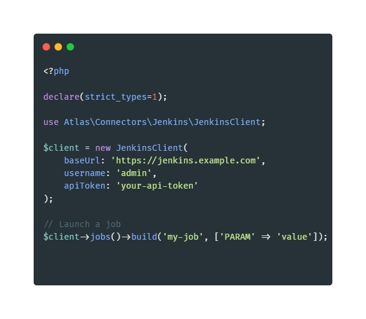

<p align="center">
  
</p>

# Atlas Jenkins Connector

A robust, modern PHP API client for Jenkins, built for the Atlas ecosystem.

## Features

- **Strictly Typed:** Leverages PHP 8.5 features for maximum reliability.
- **Resource-Based Architecture:** Scalable and easy to navigate.
- **Mock-Ready:** Designed for 100% test coverage using Guzzle MockHandler.
- **Subfolder Support:** Automatic path resolution for jobs in folders.
- **Comprehensive API:** Support for Jobs, Builds, and Users.

## Installation

```bash
composer require acamposm/atlas-jenkins-connector
```

## Usage

### Basic Initialization

```php
use Atlas\Connectors\Jenkins\JenkinsClient;

$client = new JenkinsClient(
    baseUrl: 'https://jenkins.example.com',
    username: 'admin',
    apiToken: 'your-api-token'
);
```

### Job Management

```php
// Launch a job
$client->jobs()->build('my-job', ['PARAM' => 'value']);

// Launch a job in a subfolder
$client->jobs()->build('folder/subfolder/my-job');

// Create a job from XML
$xml = file_get_contents('config.xml');
$client->jobs()->create('new-job', $xml, 'my-folder');

// List job artifacts
$artifacts = $client->jobs()->artifacts('my-job', 123);
```

### Build & Log Management

```php
// Get console logs
$logs = $client->builds()->logs('my-job', 123);

// Update build description
$client->builds()->updateDescription('my-job', 123, 'Build Successful');
```

### User Management

```php
// List all users
$users = $client->users()->list();

// Get specific user
$user = $client->users()->get('admin');
```

## Testing

```bash
composer test
```

## Static Analysis

```bash
composer analyse
```

## License

MIT
